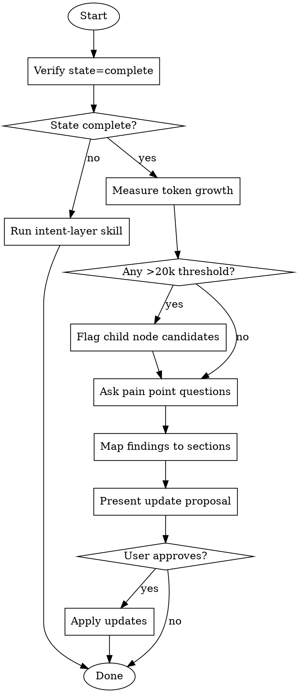

# Intent Layer Maintenance

Run the maintenance flywheel for projects with an existing Intent Layer.

## Prerequisites

- Project must have Intent Layer state = `complete`
- Run `intent-layer` skill first if state is `none` or `partial`

## Workflow



## Step 1: Verify State

```bash
# From intent-layer skill
scripts/detect_state.sh /path/to/project
```

If state is not `complete`, redirect to `intent-layer` skill for initial setup.

## Step 2: Measure Token Growth

Use the consolidated measurement script to analyze all candidates at once:

```bash
# Recommended: Auto-discover and measure all candidates
scripts/estimate_all_candidates.sh /path/to/project

# Or measure individual directories manually:
scripts/estimate_tokens.sh /path/to/project/src
scripts/estimate_tokens.sh /path/to/project/lib
```

**Thresholds:**
- Directory >20k tokens → candidate for child AGENTS.md
- Directory grew >50% since last audit → review coverage

## Step 3: Ask Pain Point Questions

Generate a structured template to capture findings:

```bash
scripts/capture_pain_points.sh pain_points.md
# Then fill in the generated template
```

These questions surface tribal knowledge that should be documented:

### Recent Pitfalls (distinct from Anti-patterns)
- "What surprised you in the last 3 months?"
- "What looked deprecated/unused but actually wasn't?"
- "What broke silently when someone made a reasonable assumption?"
- "What implicit assumption bit someone?"

### Contract Violations
- "Did any invariant get violated? Should we document it?"
- "Did external consumers break because of API changes?"
- "Are there new 'must never happen' rules?"

### Architecture Changes
- "Were any significant technical decisions made?"
- "Should we link to new ADRs or design docs?"
- "Did subsystem boundaries shift?"

### Entry Point Changes
- "Are there new common tasks that need routing?"
- "Did any entry points move or get renamed?"

## Step 4: Map Findings to Sections

| Finding Type | Target Section |
|--------------|----------------|
| Surprising behavior | Pitfalls |
| "Never do X" rule | Anti-patterns |
| Must-be-true constraint | Contracts & Invariants |
| Technical decision rationale | Architecture Decisions |
| New common task | Entry Points |
| New subsystem | Subsystem Boundaries |
| Relationship to external | Related Context |

## Step 5: Present Update Proposal

Show user exactly what will change:

```markdown
## Proposed Updates to CLAUDE.md

### Pitfalls (adding 2)
+ `config/legacy.json` looks unused but controls feature flags for enterprise clients
+ Running `make clean` deletes cached auth tokens - must re-authenticate

### Contracts (adding 1)
+ API v2 endpoints require `X-Request-ID` header (enforced by gateway, not code)

### No changes needed
- Anti-patterns
- Architecture Decisions
- Entry Points
```

## Step 6: Apply Updates (if approved)

Edit the CLAUDE.md file to add new items to appropriate sections.

**Validation after update:**
- Node still <4k tokens
- No duplication with ancestor nodes
- Relative paths for internal links

## Quick Reference

| Audit Type | Focus |
|------------|-------|
| Quarterly review | Full: tokens + all question categories |
| Post-incident | Pitfalls + Contracts that were violated |
| After refactor | Entry Points + Subsystem Boundaries |
| After new feature | Architecture Decisions + Patterns |

## Common Mistakes

| Mistake | Fix |
|---------|-----|
| Conflating Pitfalls with Anti-patterns | Pitfalls = surprising truth. Anti-patterns = things to avoid. |
| Adding every small finding | Only add if it would confuse future agents/engineers |
| Not measuring before asking | Always measure first - growth data informs questions |
| Updating without proposal | Show changes, get approval, then apply |

## On Merge/PR: Detect Affected Nodes

When code changes (e.g., after merge), identify which Intent Nodes need review:

```bash
scripts/detect_changes.sh main HEAD
```

This outputs affected nodes in leaf-first order. Check each for behavior changes.

---

## Agent-Driven Capture (Alternative)

For complex areas where template-based capture (`capture_pain_points.sh`) feels insufficient, use agent-driven capture:

1. Agent examines code, proposes descriptions, asks questions
2. Human corrects, answers, adds historical context
3. Iterate until description matches mental model

See `references/capture-workflow-agent.md` for the full three-phase process.

Use `scripts/capture_state.sh` to generate a tracking template for open questions during capture.

---

## Scripts Location

This skill uses scripts from the `intent-layer` skill:

| Script | Purpose |
|--------|---------|
| `detect_state.sh` | Check state (none/partial/complete) |
| `estimate_tokens.sh` | Measure single directory |
| `estimate_all_candidates.sh` | Measure all candidates at once |
| `capture_pain_points.sh` | Generate pain points template |
| `capture_state.sh` | Track open questions during capture |
| `detect_changes.sh` | Find affected nodes on merge/PR |
| `analyze_structure.sh` | Find semantic boundaries |
| `validate_node.sh` | Check node quality after updates |

**References:**
- `references/templates.md` - Templates (S/M/L), three-tier boundaries
- `references/compression-techniques.md` - Compression techniques, LCA placement, parent node compression
- `references/capture-workflow-agent.md` - Agent-driven capture workflow
- `references/agent-feedback-protocol.md` - How agents surface missing context

All paths: `~/.claude/skills/intent-layer/`
