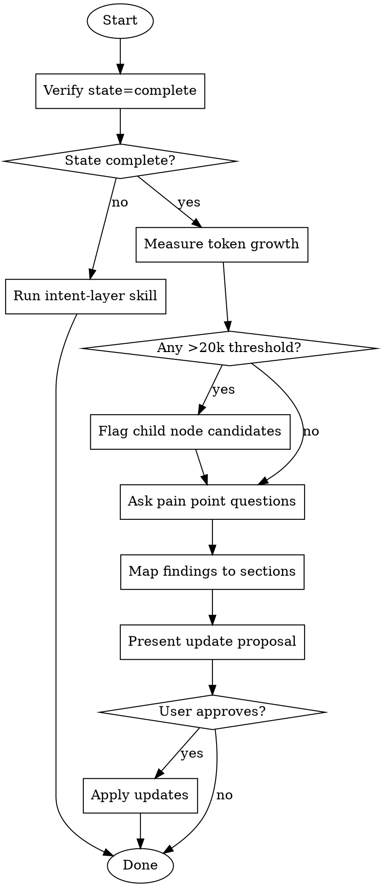

# Intent Layer Maintenance

Run the maintenance flywheel for projects with an existing Intent Layer.

## Prerequisites

- Project must have Intent Layer state = `complete`
- Run `intent-layer` skill first if state is `none` or `partial`

## Workflow



## Step 0: Process Pending Findings

Before starting maintenance, process any accumulated agent feedback:

```bash
# Check for pending findings
ls -la .intent-layer/mistakes/pending/ 2>/dev/null || echo "No pending findings"

# Check staleness
scripts/detect_staleness.sh --code-changes /path/to/project
```

### Process Each Pending Finding

For each file in `.intent-layer/mistakes/pending/`:

1. **Review finding** - Is it accurate?
2. **Decide disposition**:
   - Accept → Update node, move to `accepted/`
   - Reject → Document why, move to `rejected/`
   - Defer → Keep in `pending/` with note
3. **Update metrics** in `.intent-layer/metrics.json`

### Staleness Report

If `detect_staleness.sh` flags nodes:

| Signal | Action |
|--------|--------|
| Node >90 days old, code changed | Review for stale content |
| High git activity in directory | Check if Entry Points changed |
| New files added | Check if Code Map needs updates |
| Deleted files | Check for broken Downlinks |

## Step 1: Verify State

```bash
# From intent-layer skill
scripts/detect_state.sh /path/to/project
```

If state is not `complete`, redirect to `intent-layer` skill for initial setup.

## Step 2: Measure Token Growth

Use the consolidated measurement script to analyze all candidates at once:

```bash
# Recommended: Auto-discover and measure all candidates
scripts/estimate_all_candidates.sh /path/to/project

# Or measure individual directories manually:
scripts/estimate_tokens.sh /path/to/project/src
scripts/estimate_tokens.sh /path/to/project/lib
```

**Thresholds:**
- Directory >20k tokens → candidate for child AGENTS.md
- Directory grew >50% since last audit → review coverage

## Step 3: Ask Pain Point Questions

Generate a structured template to capture findings:

```bash
scripts/capture_pain_points.sh pain_points.md
# Then fill in the generated template
```

These questions surface tribal knowledge that should be documented:

### Recent Pitfalls (distinct from Anti-patterns)
- "What surprised you in the last 3 months?"
- "What looked deprecated/unused but actually wasn't?"
- "What broke silently when someone made a reasonable assumption?"
- "What implicit assumption bit someone?"

### Contract Violations
- "Did any invariant get violated? Should we document it?"
- "Did external consumers break because of API changes?"
- "Are there new 'must never happen' rules?"

### Architecture Changes
- "Were any significant technical decisions made?"
- "Should we link to new ADRs or design docs?"
- "Did subsystem boundaries shift?"

### Entry Point Changes
- "Are there new common tasks that need routing?"
- "Did any entry points move or get renamed?"

## Step 4: Map Findings to Sections

### From Pain Point Questions
| Finding Type | Target Section |
|--------------|----------------|
| Surprising behavior | Pitfalls |
| "Never do X" rule | Boundaries (Never) |
| Must-be-true constraint | Contracts |
| Technical decision rationale | Decisions |
| New common task | Entry Points |
| New subsystem | Downlinks |

### From Agent Feedback (v2 Types)
| Finding Type | Target Section | Priority |
|--------------|----------------|----------|
| Missing pitfall | Pitfalls | High |
| Stale contract | Contracts | High |
| Missing code map | Code Map → Find It Fast | Medium |
| Missing ext dep | External Dependencies | High |
| Missing data flow | Data Flow | Medium |
| Missing rationale | Design Rationale | High |
| **Rationale violation** | **Design Rationale** | **Critical** |
| Missing pattern | Patterns | Medium |
| Suspected dead | (verify, then Pitfalls or remove) | Low |

**Note**: "Rationale violation" is the highest priority. It indicates strategic knowledge that prevents repeated mistakes. Always process these first.

## Step 5: Present Update Proposal

Show user exactly what will change:

```markdown
## Proposed Updates to CLAUDE.md

### Pitfalls (adding 2)
+ `config/legacy.json` looks unused but controls feature flags for enterprise clients
+ Running `make clean` deletes cached auth tokens - must re-authenticate

### Contracts (adding 1)
+ API v2 endpoints require `X-Request-ID` header (enforced by gateway, not code)

### No changes needed
- Anti-patterns
- Architecture Decisions
- Entry Points
```

## Step 6: Apply Updates (if approved)

Edit the CLAUDE.md file to add new items to appropriate sections.

**Validation after update:**
- Node still <4k tokens
- No duplication with ancestor nodes
- Relative paths for internal links
- Downlinks point to existing child nodes
- Navigation links (parent/siblings) are accurate

## Step 7: Verify Loop Closure

After updates, verify the learning loop is closed:

### For Pre-flight Checks
Re-run the scenario that caused the original mistake:
1. Simulate the agent task that failed
2. Verify the new check would have caught the mistake
3. If not → refine the check

### For Pitfalls
Verify the pitfall is now discoverable:
1. Would an agent reading this section now understand?
2. Is the "why" clear, not just the "what"?

### For Design Rationale
Verify the rationale prevents future violations:
1. If someone proposed the rejected alternative, would they understand why not?
2. Is the constraint clearly stated?

### Update Metrics

After processing findings, update `.intent-layer/metrics.json`:

```bash
# Example: increment accepted count
jq '.findings.accepted += 1' .intent-layer/metrics.json > tmp.json && mv tmp.json .intent-layer/metrics.json
```

## Quick Reference

| Audit Type | Focus |
|------------|-------|
| Quarterly review | Full: tokens + all question categories |
| Post-incident | Pitfalls + Contracts that were violated |
| After refactor | Entry Points + Subsystem Boundaries |
| After new feature | Architecture Decisions + Patterns |

## Common Mistakes

| Mistake | Fix |
|---------|-----|
| Conflating Pitfalls with Anti-patterns | Pitfalls = surprising truth. Anti-patterns = things to avoid. |
| Adding every small finding | Only add if it would confuse future agents/engineers |
| Not measuring before asking | Always measure first - growth data informs questions |
| Updating without proposal | Show changes, get approval, then apply |

## On Merge/PR: Detect Affected Nodes

When code changes (e.g., after merge), identify which Intent Nodes need review:

```bash
scripts/detect_changes.sh main HEAD
```

This outputs affected nodes in leaf-first order. Check each for behavior changes.

---

## Parallel Audit (Large Intent Layers)

For Intent Layers with 4+ nodes, use parallel subagents to speed up audits.

### When to Use Parallel Audit

| Node Count | Approach |
|------------|----------|
| 1-3 nodes | Sequential (standard workflow) |
| 4-8 nodes | Parallel validation + gap detection |
| 9+ nodes | Full parallel mode |

### Parallel Validation

Validate all nodes simultaneously with multiple Task calls in a single message:

```
Task 1 (Explore): "Validate CLAUDE.md against the codebase. Check:
                   - Are Entry Points still accurate?
                   - Are Contracts still enforced?
                   - Are Pitfalls still relevant?
                   - Any new patterns not documented?
                   Return: list of stale items + missing items"

Task 2 (Explore): "Validate src/api/AGENTS.md against src/api/. Check:
                   - Are Entry Points still accurate?
                   - Are Contracts still enforced?
                   - Are Pitfalls still relevant?
                   Return: list of stale items + missing items"

Task 3 (Explore): "Validate src/core/AGENTS.md against src/core/. Check:
                   [same questions]"
```

### Parallel Gap Detection

Find undocumented areas across the codebase:

```
Task 1 (Explore): "Search for error handling patterns in src/. Find:
                   - try/catch patterns that aren't documented
                   - Silent failures that should be Pitfalls
                   - Error contracts not in any AGENTS.md"

Task 2 (Explore): "Search for API contracts in src/. Find:
                   - Input validation rules not documented
                   - Response shapes not in Contracts
                   - Auth/permissions not documented"

Task 3 (Explore): "Search for integration points in src/. Find:
                   - External service calls
                   - Database access patterns
                   - Message queue usage
                   Check if documented in nearest AGENTS.md"
```

### Parallel Post-Incident Review

After an incident, audit relevant nodes in parallel:

```
Task 1 (Explore): "Review [incident area] for Pitfalls. Find:
                   - What assumption was violated?
                   - What would have prevented this?
                   - What should be added to Pitfalls?"

Task 2 (Explore): "Review [incident area] for Contract gaps. Find:
                   - What invariant was broken?
                   - What constraint should be documented?
                   - What boundary was crossed?"
```

### Synthesizing Parallel Results

After parallel agents complete:

1. **Collect all findings** into a unified list
2. **Deduplicate** items found by multiple agents
3. **Categorize** by target section (Pitfalls, Contracts, Entry Points)
4. **Prioritize** by impact (incident-related > gaps > stale items)
5. **Present proposal** to user for approval

### Parallel Audit Benefits

| Metric | Sequential | Parallel |
|--------|------------|----------|
| 5-node audit | ~20 min | ~7 min |
| 10-node audit | ~40 min | ~10 min |
| Coverage consistency | Variable | Uniform |

---

## Agent-Driven Capture (Alternative)

For complex areas where template-based capture (`capture_pain_points.sh`) feels insufficient, use agent-driven capture:

1. Agent examines code, proposes descriptions, asks questions
2. Human corrects, answers, adds historical context
3. Iterate until description matches mental model

See `references/capture-workflow-agent.md` for the full three-phase process.

Use `scripts/capture_state.sh` to generate a tracking template for open questions during capture.

---

## Scripts Location

This skill uses scripts from the `intent-layer` skill:

| Script | Purpose |
|--------|---------|
| `detect_state.sh` | Check state (none/partial/complete) |
| `estimate_tokens.sh` | Measure single directory |
| `estimate_all_candidates.sh` | Measure all candidates at once |
| `capture_pain_points.sh` | Generate pain points template |
| `capture_state.sh` | Track open questions during capture |
| `detect_changes.sh` | Find affected nodes on merge/PR |
| `analyze_structure.sh` | Find semantic boundaries |
| `validate_node.sh` | Check node quality after updates |

**References:**
- `references/templates.md` - Templates (S/M/L), three-tier boundaries
- `references/compression-techniques.md` - Compression techniques, LCA placement, parent node compression
- `references/capture-workflow-agent.md` - Agent-driven capture workflow
- `references/agent-feedback-protocol.md` - How agents surface missing context

All paths: `~/.claude/skills/intent-layer/`
